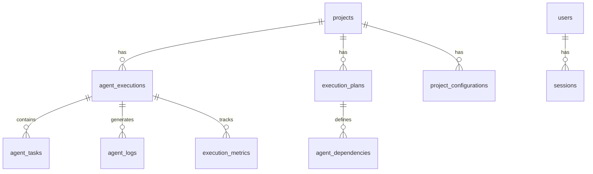

# Agent Orchestrator Dashboard Implementation Plan

## Executive Summary

The Agent Orchestrator Dashboard is a comprehensive web application designed to monitor and manage the Claude Code Agent Orchestrator system. At complexity level 2, this dashboard provides real-time monitoring, configuration management, and execution visualization for the 24-agent system.

## 1. Recommended Tech Stack

### Frontend Stack
- **Framework**: React 18.2+ with TypeScript 5.2+
- **Build Tool**: Vite 5.0 (fastest HMR and build times)
- **UI Components**: 
  - TailwindCSS 3.3+ for styling
  - shadcn/ui for consistent component library
  - Radix UI primitives for accessibility
- **State Management**: 
  - Zustand for global state
  - TanStack Query for server state
- **Real-time**: Socket.io-client 4.6+
- **Visualization**: 
  - Recharts for metrics charts
  - React Flow for execution graphs
- **Code Editor**: Monaco Editor for configuration editing

### Backend Stack
- **Runtime**: Node.js 20+ with TypeScript
- **Framework**: Express.js 4.18+
- **Real-time**: Socket.io 4.6+
- **Database**: SQLite3 (better-sqlite3 for performance)
- **File Monitoring**: Chokidar
- **Authentication**: JWT with bcrypt
- **Logging**: Winston
- **Validation**: Joi

## 2. Detailed Component Breakdown

### Core Layout Components

#### AppLayout
```typescript
interface AppLayoutProps {
  children: React.ReactNode;
  sidebar: boolean;
  theme: 'light' | 'dark';
}
```
- Responsive sidebar navigation
- Theme toggle in header
- User authentication status
- Real-time notification center

#### Dashboard Page
- **Agent Status Grid**: Real-time status cards for all 24 agents
- **Execution Metrics**: Line charts showing execution times, success rates
- **Active Projects**: Quick access cards with progress indicators
- **System Health**: CPU, memory, and process monitors

#### Projects Page
- **Project List**: DataTable with sorting, filtering, search
- **Quick Actions**: Start/Stop/Configure buttons
- **Project Creation Wizard**: Multi-step form with validation
- **Bulk Operations**: Select multiple projects for actions

#### Agents Page
- **Agent Catalog**: Grid view with capability badges
- **Performance Metrics**: Individual agent statistics
- **Configuration Editor**: Per-agent settings with JSON/YAML support
- **Collaboration Matrix**: Visual representation of agent relationships

#### Executions Page
- **Active Executions**: Real-time progress with cancel capability
- **Execution History**: Paginated table with advanced filters
- **Detailed View**: Timeline, logs, metrics, and outputs
- **Comparison View**: Compare multiple executions side-by-side

#### Flow Visualizer
- **Interactive Graph**: Drag-and-drop nodes with React Flow
- **Real-time Updates**: Progress overlay on running nodes
- **Dependency Lines**: Color-coded by status
- **Zoom Controls**: Pan and zoom for large graphs

### Shared Components

#### AgentStatusCard
```typescript
interface AgentStatusCardProps {
  agent: Agent;
  status: 'idle' | 'running' | 'error';
  metrics?: AgentMetrics;
  onConfigure?: () => void;
}
```

#### ExecutionTimeline
```typescript
interface ExecutionTimelineProps {
  execution: Execution;
  showDetails?: boolean;
  interactive?: boolean;
}
```

#### ConfigEditor
```typescript
interface ConfigEditorProps {
  value: string;
  language: 'json' | 'yaml';
  onChange: (value: string) => void;
  schema?: JSONSchema;
}
```

## 3. Database Schema Details

### Key Tables and Relationships



### Data Types and Constraints
- UUIDs for all primary keys
- JSON columns for flexible configuration storage
- Timestamp tracking with automatic triggers
- Foreign key constraints with CASCADE deletes
- Check constraints for enum values

## 4. API Endpoint Design

### RESTful API Structure

#### Authentication Endpoints
```
POST   /api/auth/login     - User login
POST   /api/auth/logout    - User logout
POST   /api/auth/refresh   - Refresh token
GET    /api/auth/me        - Current user info
```

#### Project Management
```
GET    /api/projects                 - List projects (paginated)
POST   /api/projects                 - Create project
GET    /api/projects/:id             - Get project details
PUT    /api/projects/:id             - Update project
DELETE /api/projects/:id             - Delete project
POST   /api/projects/:id/start       - Start execution
POST   /api/projects/:id/stop        - Stop execution
GET    /api/projects/:id/status      - Real-time status
```

#### Agent Operations
```
GET    /api/agents                   - List all agents
GET    /api/agents/:name             - Agent details
GET    /api/agents/:name/status      - Current status
GET    /api/agents/:name/metrics     - Performance metrics
PUT    /api/agents/:name/config      - Update configuration
POST   /api/agents/:name/restart     - Restart agent
```

#### Execution Management
```
GET    /api/executions              - List executions
POST   /api/executions              - Start new execution
GET    /api/executions/:id          - Execution details
GET    /api/executions/:id/logs     - Stream logs
POST   /api/executions/:id/cancel   - Cancel execution
GET    /api/executions/:id/graph    - Execution flow graph
```

### WebSocket Events

#### Connection Management
```typescript
// Client → Server
socket.emit('authenticate', { token });
socket.emit('subscribe', { type: 'agent', id: agentName });
socket.emit('unsubscribe', { type: 'agent', id: agentName });

// Server → Client
socket.emit('authenticated', { user });
socket.emit('error', { message, code });
```

#### Real-time Updates
```typescript
// Agent events
socket.emit('agent:status', { agent, status, timestamp });
socket.emit('agent:metrics', { agent, metrics });

// Execution events
socket.emit('execution:started', { id, project, agents });
socket.emit('execution:progress', { id, progress, currentAgent });
socket.emit('execution:completed', { id, results, duration });
socket.emit('execution:failed', { id, error, agent });

// Log streaming
socket.emit('log:entry', { executionId, agent, level, message });
```

## 5. Implementation Phases

### Phase 1: Foundation (Days 1-3)
**Lead Agent**: orchestration-agent
**Supporting Agents**: backend-expert, database-architect

Tasks:
1. Initialize project structure
2. Set up TypeScript configurations
3. Implement database schema and migrations
4. Create basic Express server
5. Set up authentication system

### Phase 2: Backend Core (Days 4-7)
**Lead Agent**: backend-expert
**Supporting Agents**: security-specialist, database-architect

Tasks:
1. Implement all REST API endpoints
2. Set up WebSocket server with Socket.io
3. Create database models and services
4. Implement file system monitoring
5. Add webhook system

### Phase 3: Frontend Foundation (Days 8-11)
**Lead Agent**: frontend-expert
**Supporting Agents**: uiux-expert

Tasks:
1. Set up React with Vite
2. Configure TailwindCSS and shadcn/ui
3. Implement routing and layout
4. Create authentication flow
5. Build shared components

### Phase 4: Core Features (Days 12-16)
**Lead Agents**: frontend-expert, backend-expert
**Supporting Agent**: uiux-expert

Tasks:
1. Build Dashboard page with real-time updates
2. Implement Projects management
3. Create Agents catalog and configuration
4. Build Execution monitoring
5. Add Configuration management

### Phase 5: Advanced Features (Days 17-20)
**Lead Agents**: frontend-expert, backend-expert
**Supporting Agent**: data-analytics-expert

Tasks:
1. Implement Flow Visualizer with React Flow
2. Add metrics and analytics
3. Create webhook management
4. Build import/export functionality
5. Add batch operations

### Phase 6: Integration (Days 21-23)
**Lead Agent**: devops-sre-expert
**Supporting Agents**: backend-expert, qa-test-engineer

Tasks:
1. Modify orchestrator scripts for webhooks
2. Implement agent workspace monitoring
3. Add process hooks and notifications
4. Create integration tests
5. Performance optimization

### Phase 7: Testing & Deployment (Days 24-28)
**Lead Agents**: qa-test-engineer, devops-sre-expert
**Supporting Agent**: security-specialist

Tasks:
1. Unit and integration testing
2. Security audit and fixes
3. Docker containerization
4. CI/CD pipeline setup
5. Documentation and deployment

## 6. File Structure

```
agent-orchestrator-dashboard/
├── frontend/
│   ├── src/
│   │   ├── components/
│   │   │   ├── layout/
│   │   │   │   ├── AppLayout.tsx
│   │   │   │   ├── Sidebar.tsx
│   │   │   │   └── Header.tsx
│   │   │   ├── dashboard/
│   │   │   │   ├── AgentStatusGrid.tsx
│   │   │   │   ├── ExecutionMetrics.tsx
│   │   │   │   └── ProjectQuickAccess.tsx
│   │   │   ├── agents/
│   │   │   │   ├── AgentCard.tsx
│   │   │   │   ├── AgentConfig.tsx
│   │   │   │   └── CollaborationMatrix.tsx
│   │   │   ├── executions/
│   │   │   │   ├── ExecutionList.tsx
│   │   │   │   ├── ExecutionDetail.tsx
│   │   │   │   └── ExecutionTimeline.tsx
│   │   │   ├── config/
│   │   │   │   ├── ConfigEditor.tsx
│   │   │   │   ├── ImportExport.tsx
│   │   │   │   └── WebhookManager.tsx
│   │   │   └── shared/
│   │   │       ├── DataTable.tsx
│   │   │       ├── StatusBadge.tsx
│   │   │       └── LoadingSpinner.tsx
│   │   ├── pages/
│   │   │   ├── Dashboard.tsx
│   │   │   ├── Projects.tsx
│   │   │   ├── Agents.tsx
│   │   │   ├── Executions.tsx
│   │   │   └── Configuration.tsx
│   │   ├── hooks/
│   │   │   ├── useWebSocket.ts
│   │   │   ├── useAgentStatus.ts
│   │   │   └── useExecutions.ts
│   │   ├── services/
│   │   │   ├── api.ts
│   │   │   ├── websocket.ts
│   │   │   └── auth.ts
│   │   ├── store/
│   │   │   ├── auth.ts
│   │   │   ├── agents.ts
│   │   │   └── executions.ts
│   │   └── types/
│   │       ├── agent.ts
│   │       ├── execution.ts
│   │       └── project.ts
│   ├── public/
│   └── index.html
├── backend/
│   ├── src/
│   │   ├── api/
│   │   │   ├── auth.ts
│   │   │   ├── projects.ts
│   │   │   ├── agents.ts
│   │   │   ├── executions.ts
│   │   │   └── config.ts
│   │   ├── services/
│   │   │   ├── database.ts
│   │   │   ├── orchestrator.ts
│   │   │   ├── fileMonitor.ts
│   │   │   └── webhook.ts
│   │   ├── models/
│   │   │   ├── Project.ts
│   │   │   ├── Agent.ts
│   │   │   ├── Execution.ts
│   │   │   └── User.ts
│   │   ├── websocket/
│   │   │   ├── handlers.ts
│   │   │   └── events.ts
│   │   ├── middleware/
│   │   │   ├── auth.ts
│   │   │   ├── validation.ts
│   │   │   └── errorHandler.ts
│   │   └── index.ts
│   └── database/
│       ├── migrations/
│       └── seeds/
├── shared/
│   └── types/
│       └── index.ts
├── scripts/
│   ├── integration/
│   │   ├── orchestrator-hook.sh
│   │   └── webhook-notifier.sh
│   └── setup.sh
├── docker/
│   ├── Dockerfile.frontend
│   ├── Dockerfile.backend
│   └── docker-compose.yml
└── docs/
    ├── API.md
    ├── DEPLOYMENT.md
    └── DEVELOPMENT.md
```

## 7. Integration Points

### Orchestrator Script Modifications

#### Add Webhook Support
```bash
# orchestrator-hook.sh
#!/bin/bash

WEBHOOK_URL="${DASHBOARD_URL:-http://localhost:3001}/api/webhooks/notify"

notify_dashboard() {
    local event_type=$1
    local data=$2
    
    curl -X POST "$WEBHOOK_URL" \
        -H "Content-Type: application/json" \
        -H "Authorization: Bearer $DASHBOARD_TOKEN" \
        -d "{
            \"event\": \"$event_type\",
            \"timestamp\": \"$(date -u +%Y-%m-%dT%H:%M:%SZ)\",
            \"data\": $data
        }" 2>/dev/null || true
}

# Integration points in orchestrator.sh
# Before starting execution
notify_dashboard "execution:planning" "{\"project\": \"$PROJECT_NAME\", \"agents\": $AGENT_LIST}"

# On agent start
notify_dashboard "agent:started" "{\"agent\": \"$AGENT_NAME\", \"task\": \"$TASK_ID\"}"

# On agent complete
notify_dashboard "agent:completed" "{\"agent\": \"$AGENT_NAME\", \"duration\": $DURATION}"
```

#### File System Monitoring
```typescript
// fileMonitor.ts
import chokidar from 'chokidar';
import path from 'path';
import fs from 'fs/promises';

export class AgentWorkspaceMonitor {
  private watcher: chokidar.FSWatcher;
  private workspacePath = path.join(process.env.HOME!, '.claude', 'agent-workspaces');
  
  constructor(private io: Server) {
    this.watcher = chokidar.watch(this.workspacePath, {
      persistent: true,
      ignoreInitial: true,
      awaitWriteFinish: {
        stabilityThreshold: 500,
        pollInterval: 100
      }
    });
    
    this.setupWatchers();
  }
  
  private setupWatchers() {
    this.watcher
      .on('change', async (filePath) => {
        const agent = this.extractAgentName(filePath);
        const content = await this.parseAgentOutput(filePath);
        
        this.io.emit('agent:update', {
          agent,
          status: content.status,
          output: content.output,
          timestamp: new Date()
        });
      })
      .on('add', (filePath) => {
        const agent = this.extractAgentName(filePath);
        this.io.emit('agent:created', { agent });
      });
  }
  
  private extractAgentName(filePath: string): string {
    const filename = path.basename(filePath);
    const match = filename.match(/Agent-(.+)\.md/);
    return match ? match[1] : 'unknown';
  }
  
  private async parseAgentOutput(filePath: string): Promise<AgentOutput> {
    const content = await fs.readFile(filePath, 'utf-8');
    // Parse markdown content for status and outputs
    return this.parseMarkdown(content);
  }
}
```

### Database Integration
```typescript
// Extend existing SQLite database
export async function extendOrchestratorDatabase() {
  const db = new Database(ORCHESTRATOR_DB_PATH);
  
  // Check if our tables exist
  const tables = db.prepare(`
    SELECT name FROM sqlite_master 
    WHERE type='table' AND name LIKE 'dashboard_%'
  `).all();
  
  if (tables.length === 0) {
    // Run our schema migration
    await runMigration(db);
  }
  
  return db;
}
```

### MCP Server Monitoring
```typescript
// mcpMonitor.ts
export class MCPServerMonitor {
  private servers: Map<string, MCPServerStatus> = new Map();
  
  async checkServers(): Promise<MCPServerStatus[]> {
    const configPath = path.join(process.env.HOME!, '.config', 'claude', 'mcp-servers.json');
    const config = JSON.parse(await fs.readFile(configPath, 'utf-8'));
    
    for (const [name, serverConfig] of Object.entries(config)) {
      const status = await this.checkServer(name, serverConfig);
      this.servers.set(name, status);
    }
    
    return Array.from(this.servers.values());
  }
  
  private async checkServer(name: string, config: any): Promise<MCPServerStatus> {
    // Check if process is running, ports are open, etc.
    return {
      name,
      status: 'running',
      lastCheck: new Date(),
      config
    };
  }
}
```

## 8. Key Features Implementation

### Real-time Agent Status
```typescript
// Real-time status updates via WebSocket
socket.on('agent:subscribe', (agentName) => {
  socket.join(`agent:${agentName}`);
  
  // Send current status
  const status = await agentService.getStatus(agentName);
  socket.emit('agent:status', status);
  
  // Monitor for changes
  agentMonitor.on(`status:${agentName}`, (newStatus) => {
    io.to(`agent:${agentName}`).emit('agent:status', newStatus);
  });
});
```

### Execution Flow Visualization
```typescript
// React Flow configuration for execution graph
const executionFlow = {
  nodes: agents.map(agent => ({
    id: agent.id,
    type: 'agentNode',
    position: calculatePosition(agent),
    data: {
      label: agent.name,
      status: agent.status,
      progress: agent.progress
    }
  })),
  edges: dependencies.map(dep => ({
    id: `${dep.from}-${dep.to}`,
    source: dep.from,
    target: dep.to,
    type: 'smoothstep',
    animated: dep.status === 'active',
    style: getEdgeStyle(dep.status)
  }))
};
```

### Configuration Management
```typescript
// Project configuration with validation
const projectConfigSchema = Joi.object({
  name: Joi.string().required(),
  rules: Joi.array().items(Joi.string()),
  maxParallelAgents: Joi.number().min(1).max(10).default(4),
  agentConfigs: Joi.object().pattern(
    Joi.string(),
    Joi.object({
      enabled: Joi.boolean(),
      timeout: Joi.number(),
      retries: Joi.number(),
      customParams: Joi.object()
    })
  ),
  mcpServers: Joi.array().items(
    Joi.object({
      name: Joi.string().required(),
      required: Joi.boolean()
    })
  )
});
```

## 9. Performance Considerations

1. **Database Optimization**
   - Use SQLite WAL mode for concurrent reads
   - Implement connection pooling
   - Add indexes on frequently queried columns
   - Use prepared statements

2. **WebSocket Optimization**
   - Room-based subscriptions to reduce broadcasts
   - Throttle high-frequency updates
   - Implement reconnection logic
   - Use binary frames for large data

3. **Frontend Optimization**
   - Virtual scrolling for large lists
   - React.memo for expensive components
   - Lazy loading for routes
   - Debounce search inputs
   - Optimize bundle size with code splitting

4. **API Optimization**
   - Implement pagination for all list endpoints
   - Use field filtering to reduce payload size
   - Enable gzip compression
   - Implement caching headers
   - Rate limiting per user/IP

## 10. Security Implementation

1. **Authentication & Authorization**
   - JWT tokens with refresh mechanism
   - Role-based access control (Admin, Operator, Viewer)
   - Secure password hashing with bcrypt
   - Session management with expiry

2. **API Security**
   - CORS configuration
   - Helmet.js for security headers
   - Input validation with Joi
   - SQL injection prevention
   - XSS protection

3. **WebSocket Security**
   - Token-based authentication
   - Origin validation
   - Rate limiting
   - Event validation

## Conclusion

This comprehensive dashboard provides complete visibility and control over the Claude Code Agent Orchestrator system. The modular architecture allows for easy extension and the real-time capabilities ensure operators always have current information about agent activities and system health.